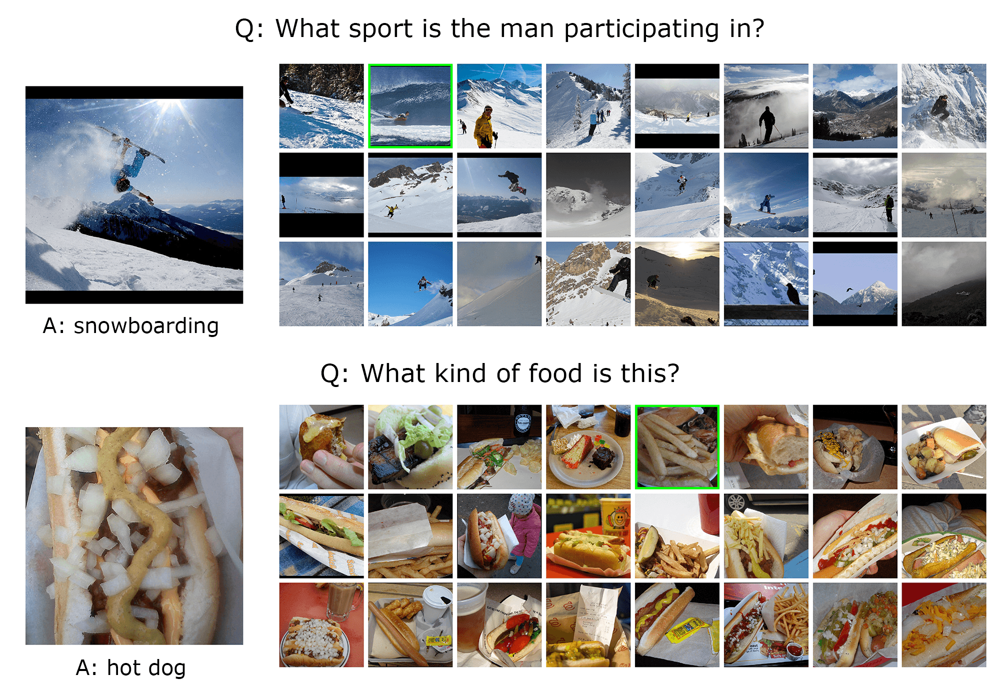
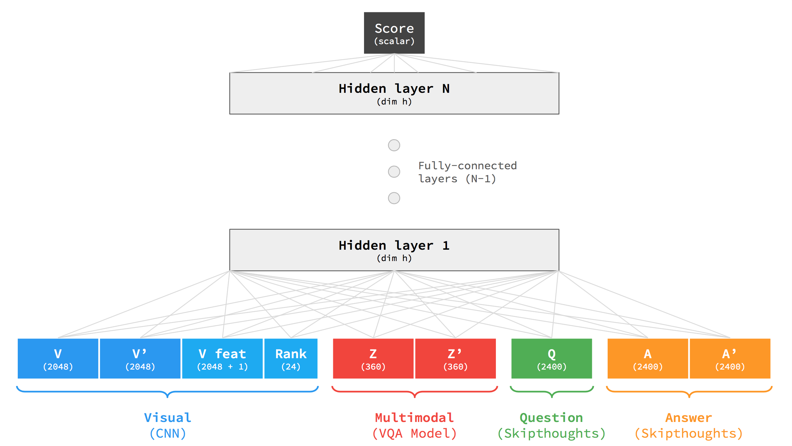
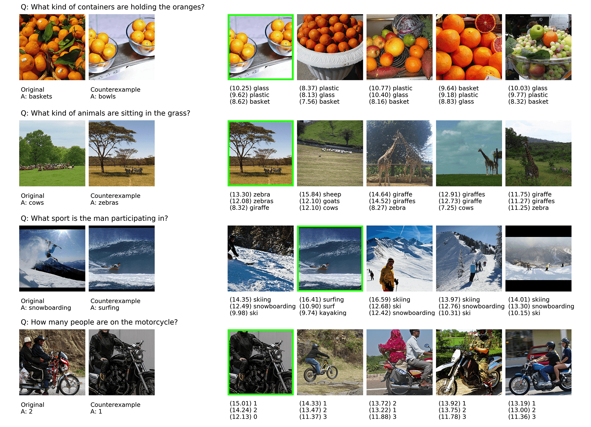

# Identifying Counterexamples in Visual Question Answering

## Abstract

Visual question answering (VQA) models respond to open-ended natural language questions about images. While VQA is an increasingly popular area of research, it is unclear to what extent current VQA architectures learn key semantic distinctions between visually-similar images. To investigate this question, we explore a reformulation of the VQA task that challenges models to identify counterexamples: images that result in a different answer to the original question. We introduce two plug-and-play methods for evaluating existing VQA models against a supervised counterexample prediction task, VQA-CX. While our models surpass existing benchmarks on VQA-CX, we find that the multimodal representations learned by an existing state-of-the-art VQA model contribute only marginally to performance on this task. These results call into question the assumption that successful performance on the VQA benchmark is indicative of general visual-semantic reasoning abilities.

## Counterexample Task

<p align="center">
   
</p>

We use the [VQA 2.0](http://www.visualqa.org) dataset, which contains natural language questions and answers about images from [COCO](http://cocodataset.org). In an effort to reduce biases in the data, VQA 2.0 improved on the original VQA dataset by introducing complementary pairs: images that produce different answers to the same question. 

We utilize this labeled complementary pairs data to construct an alternative task, VQA-CX, that focuses on counterexample prediction. Given an image, question, and answer, the goal is to identify a counterexample image that produces a different answer to the original question. For instance, under the standard VQA task, given the question "What color is the fire hydrant?" and an image of a street scene, a model might answer "red." Under the alternative task, the model must produce a counterexample; e.g., an image of a fire hydrant that is *not* red. Successful performance on this task, which we call VQA-CX, requires reasoning about about how subtle visual differences between images affect the high-level semantics of a scene.

In order to frame VQA-CX as a supervised learning task, we present the model with 24 similar images (these are the 24 nearest neighbors in visual feature space). The model must learn to select a good counterexample from these images. The labeled complementary image from VQA 2.0, which was selected by humans as a good counterexample, serves as the ground truth.

## Model

We present NeuralCX, a simple but effective model that achieves strong performance on VQA-CX. The NeuralCX model is a multilayer perceptron that takes as input various multimodal features derived from the image, question, and answer.

<p align="center">
   
</p>

## Results

NeuralCX outperforms the existing baselines and machine learning approaches for counterexample prediction, including the CX model from [Goyal et al., 2016](https://arxiv.org/abs/1612.00837). Our model ranks the ground truth counterexample in the top 5 (out of 24) more than half of the time. Given the complexity of the task, the general difficulty of the questions in VQA 2.0, and the fact that multiple of the 24 images may potentially serve as a good counterexample, high accuracy on VQA-CX is quite difficult.

Model | Recall@1 | Recall@5
----- | -------- | --------
Random Baseline | 4.20 | 20.85
Hard Negative Mining | 4.34 | 22.06
Semantic Baseline | 7.77 | 30.26
Distance Baseline | 11.51 | 44.48
Two-Headed CX Model (Goyal et al., 2016) | - | 43.39
**NeuralCX** | **18.47** | **55.14**

<p align="center">
   
</p>

Notably, while our models surpass existing benchmarks on VQA-CX, we find that feeding NeuralCX the multimodal representations learned by an existing state-of-the-art VQA model contribute only marginally to performance. (Consult the paper for more information about our methods and results using pretrained VQA models.) We also observed that the VQA model assigns high probability to answers with opposite meanings. These results suggest that VQA models that perform well on the original task do not necessarily learn conceptual distinc- tions between visually-similar images. Our findings raise important questions about the effectiveness of VQA as a benchmark of multimodal reasoning.

## Instructions for using this repo

This repo requires a Pytorch environment for Pytorch 3 running on a CUDA-enabled machine. 

First, follow the instructions at [vqa.pytorch](https://github.com/Cadene/vqa.pytorch) to get the base repo up and running. You'll need to download the VQA 2.0 dataset, extract the visual features using FBResNet-152. Optionally, you can pretrain a MUTAN VQA model to produce multimodal features for NeuralCX.

All of our models can be run from `counterexamples.py`. To reproduce results from NeuralCX, simply run:

```
python3 counterexamples.py --cx_model NeuralModel --epochs 20
```

Add the `--test` flag to evaluate the model on the full test set.


## Acknowledgments

This work was done as part of a final project for CS 287 at Harvard. Thanks to Sasha Rush and Yoon Kim for sharing their advice, expertise, and feedback.

This project is based on the [VQA Pytorch](https://github.com/Cadene/vqa.pytorch) codebase. Thanks to Remi Cadene for making this code public, which greatly expedited our work, and for providing additional help via email.
